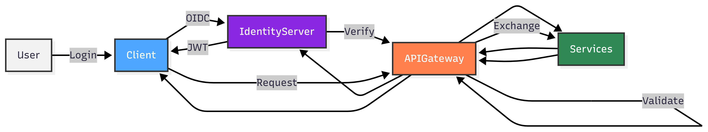

# 🛒 Ecommerce Microservices System
#### 📄 Xem chi tiết tại:** [**Project README.md**](https://github.com/nguyenthinh28902/mini-project-ecommerce/blob/main/README.md)
Hệ thống thương mại điện tử kiến trúc Microservices tập trung vào bảo mật và hiệu năng.
*(Dự án đang trong quá trình phát triển tính năng nghiệp vụ)*
#### 🛠️ Technology Stack
* **Backend Framework:** .NET 10, Entity Framework Core.
* **Infrastructure:** YARP (Yet Another Reverse Proxy), Duende.IdentityServer.
* **Databases:** SQL Server (Mô hình Database per Service).
* **Communication:** gRPC (Đồng bộ), RabbitMQ (Bất đồng bộ).
* **Security & Packages:** Identity Server, JWT, Secure Cookies, Redis.
---

### 🔗 System Architecture (Sơ đồ hệ thống)

---

### 🔑 Centralized Authentication Flow (Luồng xác thực tập trung)


#### 🔑 Access Token Examples

**Token nội bộ (Internal Token - Gateway to Service)**
```json
{
  "header": { "alg": "RS256", "kid": "2BF45F2C062C3F7CFD022EC23707CA44", "typ": "at+jwt" },
  "payload": {
    "iss": "https://localhost:7133",
    "aud": ["product.api", "user.api"],
    "scope": ["order.internal", "payment.internal", "product.internal", "stock.internal", "user.internal"],
    "client_id": "APIGatewayCMS"
  }
}
```
**Token Client (Public Token - Client to Gateway)**
```json
{
  "header": { "alg": "RS256", "kid": "2BF45F2C062C3F7CFD022EC23707CA44", "typ": "at+jwt" },
  "payload": {
    "iss": "https://localhost:7133",
    "aud": ["user.api", "product.api"],
    "scope": ["openid", "profile", "email", "user.read", "user.write", "product.read", "order.write"],
    "client_id": "cms_admin_client",
    "sub": "4" // Id user.
  }
}
```
---
### 📂 Project Structure & Repositories

| Phân tầng | Dự án | Mô tả & Link Repository |
| :--- | :--- | :--- |
| **Presentation** | Web / CMS | [Storefront](https://github.com/nguyenthinh28902/ecommerce-web) / [Dashboard Quản trị](https://github.com/nguyenthinh28902/ecommerce-cms-web) |
| **Identity** | Web / CMS IdP | [Web IdP](https://github.com/nguyenthinh28902/ecommerce-web-identityserver) / [CMS IdP (Duende)](https://github.com/nguyenthinh28902/ecommerce-identity-server-cms) |
| **Gateway** | Public / Admin | [Web Gateway](https://github.com/nguyenthinh28902/ecommerce-api-gateway) / [CMS Gateway (YARP)](https://github.com/nguyenthinh28902/ecommerce-api-gateway-cms) |
| **Services** | Core Business | [Product](https://github.com/nguyenthinh28902/Ecom.ProductService), [Order](https://github.com/nguyenthinh28902/ecom-order-service), [Payment](https://github.com/nguyenthinh28902/ecom-payment), [User](https://github.com/nguyenthinh28902/ecommerce-identity-cms), [Customer](https://github.com/nguyenthinh28902/ecommerce-customer-service), [Notification](https://github.com/nguyenthinh28902/ecom-notification-service) |

---
### 🚀 Key Features (Tính năng chính)
* **Phân quyền đa tầng:** Tách biệt hoàn toàn luồng người dùng (Web) và quản trị viên (CMS) từ giao diện đến Gateway.
* **Xác thực tập trung (SSO):** Sử dụng Identity Server để quản lý đăng nhập tập trung cho toàn bộ hệ sinh thái.
* **Xử lý đơn hàng hiệu năng cao:** Kết hợp gRPC để kiểm tra tồn kho thời gian thực và RabbitMQ để xử lý thanh toán/thông báo bất đồng bộ.
* **Cơ chế Caching thông minh:** Giảm tải cho database bằng cách lưu trữ thông tin định danh và sản phẩm phổ biến trên Redis.

---

### 🔐 Security Pattern: Token Exchange & Identity Delegation
Hệ thống thiết lập ranh giới bảo mật nghiêm ngặt giữa tầng Client và nội bộ Backend:

* **Identity Delegation**: Identity Server truy vấn Claims từ **User Service** thông qua Gateway bằng luồng **Client Credentials**.
* **Security Transformation**: Gateway hoán đổi Public Token thành **Internal JWT (System Token)** để bảo vệ thông tin nhạy cảm.
* **Context Passing**: Sử dụng Custom Header (`X-User-Id`) để truyền tải định danh người dùng giữa các dịch vụ nội bộ.
* **Performance**: Tối ưu bằng **Distributed Caching (Redis)** để kiểm tra thông tin người dùng trước khi gọi API, giảm tải cho Resource Server.

---

### 🔄 Internal Communication Pattern (Giao tiếp nội bộ)
* **Synchronous (Đồng bộ)**: Triển khai **gRPC** cho các tác vụ đòi hỏi hiệu năng cao và phản hồi tức thời (Ví dụ: Order Service truy vấn tồn kho từ Product Service).
* **Asynchronous (Bất đồng bộ)**: Sử dụng **RabbitMQ** xử lý sự kiện (Event-driven). Ví dụ: `Notification Service` tiêu thụ sự kiện đơn hàng để gửi thông báo mà không gây nghẽn luồng chính.
