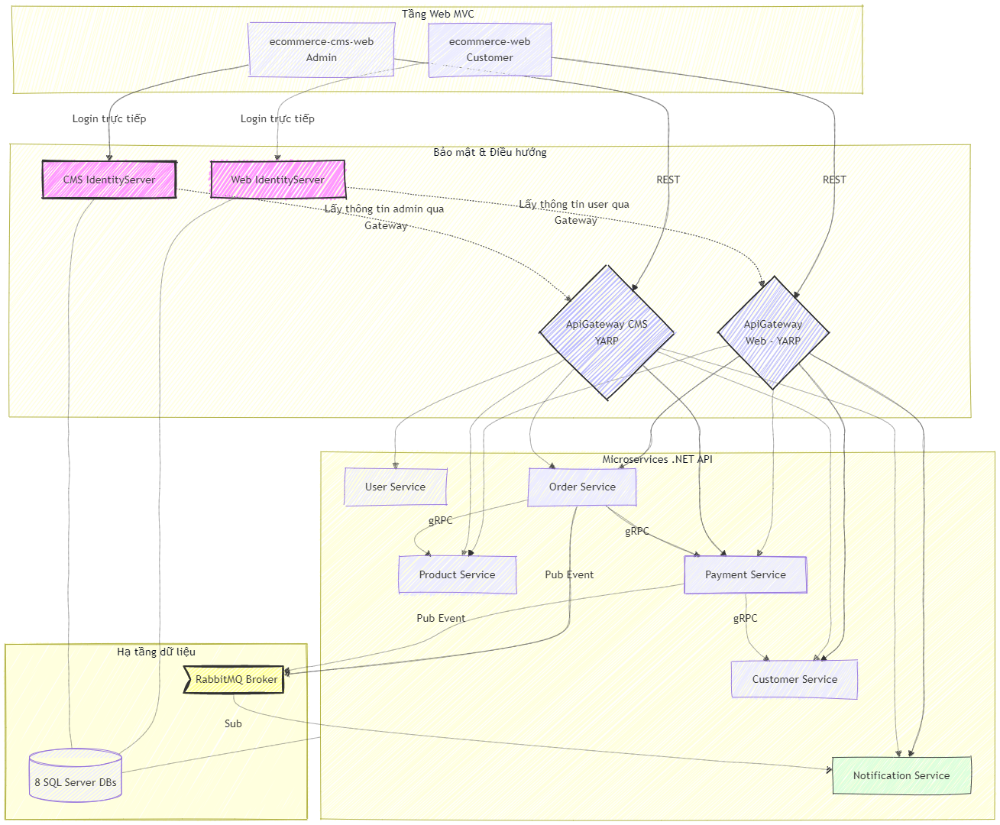
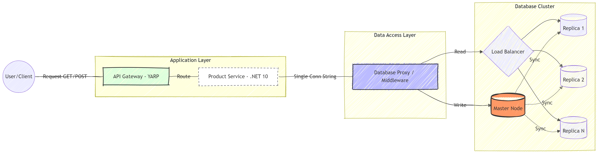
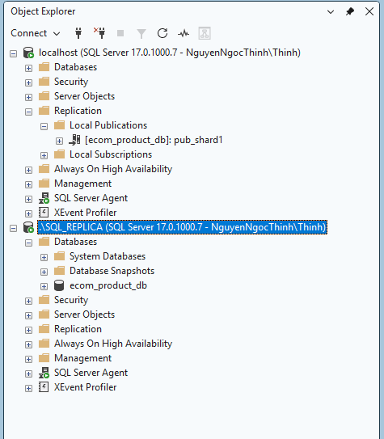
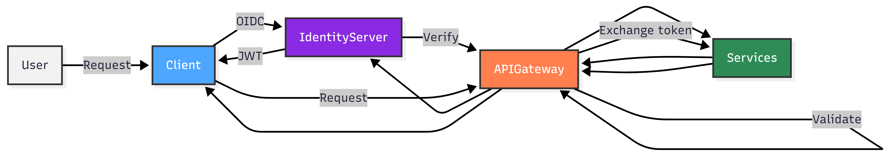
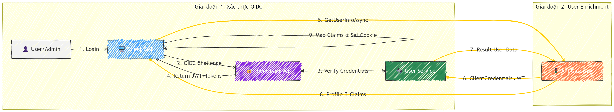

# Ecommerce System
Dự án hệ thống thương mại điện tử
#### Dự án còn đang phát triển chưa hoàn thành nhiều tính năng nghiệp vụ (tạo dữ liệu mẫu để test).

#### 📄 Xem tóm tắt:** [**Project Overview.md**](https://github.com/nguyenthinh28902/mini-project-ecommerce/blob/main/Overview.md)
---

### 🔗 Technical Implementation (Chi tiết triển khai kỹ thuật)
Để hiểu rõ cách hệ thống vận hành, bạn có thể tham khảo chi tiết cấu hình tại các tầng sau:
* **Presentation Security (Client-Side):**
    * Triển khai OIDC Middleware để quản lý phiên đăng nhập và bảo mật Cookie.
    * Cấu hình chuyển hướng tự động tới Identity Server.
    * [Xem cấu hình tại Web CMS](https://github.com/nguyenthinh28902/ecommerce-cms-web)
* **Identity Provider Configuration:**
    * Định nghĩa các `IdentityResources`, `ApiScopes` và `ApiResources`.
    * Cấu hình Client Credentials cho Gateway và Authorization Code cho các ứng dụng MVC.
    * Triển khai Custom Profile Service để mapping Claims từ API User/Customer.
    * [Xem cấu hình tại Identity Server](https://github.com/nguyenthinh28902/ecommerce-identity-server-cms)
* **Gateway Routing & Security (YARP):**
    * Cấu hình Reverse Proxy chuyển tiếp yêu cầu dựa trên Route.
    * Triển khai Policy xác thực tại Gateway để đảm bảo chỉ các request có Token hợp lệ mới được đi vào tầng Service.
    * [Xem cấu hình tại Gateway](https://github.com/nguyenthinh28902/ecommerce-api-gateway-cms)
* **Service-Level:**
    * **Xác thực & Phân quyền:** Triển khai **JWT Bearer** và **Policy-based Authorization** (Scopes/Claims) tập trung tại từng Microservice.
    * **Bảo mật giao tiếp (gRPC):** Sử dụng **Interceptors** để thực thi xác thực Client/Server trong các lời gọi hàm đồng bộ cao tốc.
    * **Bảo mật thông điệp (Async):** Tích hợp cấu hình hạ tầng và mã hóa cho **RabbitMQ & MassTransit** đảm bảo an toàn luồng sự kiện.
    * [Xem cấu hình tại Product Service](https://github.com/nguyenthinh28902/Ecom.ProductService)
* **Identity CMS Core & Authorization Logic:**
    * Định nghĩa cấu trúc các thực thể cốt lõi bao gồm `ApplicationUser`, `ApplicationDepartment` và `DepartmentPermission`.
    * Triển khai logic ánh xạ và chuyển đổi quyền hạn từ cơ sở dữ liệu sang định dạng Scopes.
    * [Xem cấu hình tại Identity CMS Core](https://github.com/nguyenthinh28902/ecommerce-identity-cms/blob/main/README.md)
---

## 1. System Architecture (Kiến trúc hệ thống)


### 🛠️ Technology Used (Công nghệ sử dụng)
* **Core Framework:** .NET 10 / .NET 8, ASP.NET Core MVC & Web API.
* **Databases & Persistence:** SQL Server (Database per Service), Entity Framework Core.
* **Infrastructure:** YARP (API Gateway), Duende IdentityServer.
* **Security & Protocols:** OpenID Connect (OIDC), OAuth 2.0, JWT Bearer, Cookie Authentication, Policy-based Authorization.
* **Communication:** gRPC (Đồng bộ), RabbitMQ / MassTransit (Bất đồng bộ).
* **Caching & Performance:** Redis Cache (Docker), Memory Cache, Redis Rate Limiting.
* **State Management:** Secure Cookies, Session Management.  
Xem chi tiết tại: [7. Technology Used (Công nghệ sử dụng)](#7-technology-used-công-nghệ-sử-dụng)
---
## 📂 2. Project Structure (Cấu trúc dự án)
### A. Presentation Layer (Tầng giao diện)
| Project | Mô tả | Link Repository |
| :--- | :--- | :--- |
| **Ecommerce web** | Storefront phục vụ khách hàng mua sắm, tích hợp OIDC xác thực người dùng.| [github.com/Ecom.Web](https://github.com/nguyenthinh28902/ecommerce-web) |
| **Ecommerce cms web** | Dashboard quản trị nội bộ. | [github.com/Ecom.Cms](https://github.com/nguyenthinh28902/ecommerce-cms-web) |
### B. Infrastructure & Security (Tầng hạ tầng & Bảo mật)
#### Identity server (Duende.IdentityServer)
| Project | Mô tả | Link Repository |
| :--- | :--- | :--- |
| **Web Identity Server** | Identity Provider (IdP) xử lý đăng nhập, cấp phát token cho khách hàng. | [github.com/Ecom.Web.Identityserver](https://github.com/nguyenthinh28902/ecommerce-web-identityserver) |
| **CMS Identity Server** | Trung tâm định danh dành riêng cho quản trị viên và nhân viên vận hành. | [github.com/Ecom.Cms.Identityserver](https://github.com/nguyenthinh28902/ecommerce-identity-server-cms) |
#### API Gateway Layer (YARP)
| Project | Mô tả | Link Repository |
| :--- | :--- | :--- |
| **Api Gateway** | Gateway điều hướng (Reverse Proxy) và lọc quyền truy cập cho ứng dụng Web. | [github.com/ecommerce-api-gateway](https://github.com/nguyenthinh28902/ecommerce-api-gateway) |
| **Api Gateway CMS** | Gateway điều hướng tập trung, tích hợp bảo mật nội bộ cho hệ thống CMS. | [github.com/ecommerce-api-gateway-cms](https://github.com/nguyenthinh28902/ecommerce-api-gateway-cms) |
### C. Core Business Services (Các dịch vụ nghiệp vụ)
| Service | Mô tả | Link Repository |
| :--- | :--- | :--- |
| **User Service** | Quản lý định danh, phân quyền cho nhân viên quản trị. (ASP.NET Core Identity)| [github.com/ecommerce-identity-cms](https://github.com/nguyenthinh28902/ecommerce-identity-cms) |
| **Customer Service** | Lưu trữ hồ sơ khách hàng. | [github.com/ecommerce-customer-service](https://github.com/nguyenthinh28902/ecommerce-customer-service) |
| **Product Service** | Quản lý danh mục sản phẩm. | [github.com/Ecom.ProductService](https://github.com/nguyenthinh28902/Ecom.ProductService) |
| **Order Service** | Xử lý quy trình đặt hàng, quản lý giỏ hàng và trạng thái đơn hàng. | [github.com/Ecom.OrderService](https://github.com/nguyenthinh28902/ecom-order-service) |
| **Payment Service** | Xử lý cổng thanh toán, lịch sử giao dịch và đối soát tài chính. | [github.com/Ecom.PaymentService](https://github.com/nguyenthinh28902/ecom-payment) |
| **Notification Service** | Worker xử lý gửi thông báo (Email/Push) qua hàng đợi RabbitMQ. | [github.com/Ecom.Notification](https://github.com/nguyenthinh28902/ecom-notification-service) |
---

### 🏛️ 3. Architecture Description (Mô tả kiến trúc)
#### 🖥️ 3.1 Client Layer (Tầng giao diện & Người dùng)
Hệ thống phân tách luồng người dùng ngay từ cấp độ giao diện để đảm bảo tính bảo mật và trải nghiệm chuyên biệt:
* **Web MVC (Khách hàng):** Storefront phục vụ người dùng cuối tham quan, mua sắm và thanh toán trực tuyến.
* **CMS MVC (Quản trị):** Dashboard nội bộ dành cho đội ngũ vận hành quản lý sản phẩm, đơn hàng và hệ thống.
#### 🛡️ 3.2 Entry Points & Security (Tầng bảo mật & Điều hướng)
* **Identity Server (Duende):** Trung tâm định danh (Identity Provider) tập trung, xử lý xác thực theo tiêu chuẩn OIDC/OAuth2.
  * **Cơ chế xác thực & Tính đóng gói (Encapsulation):** Để đảm bảo tính đóng gói, Identity Server không kết nối trực tiếp vào Database của các Service. 
  * **Mối quan hệ Identity & Resource:** **User Service** đóng vai trò là **Resource Server** lưu trữ thông tin định danh. Identity Server không nắm giữ dữ liệu người dùng mà thực hiện truy vấn thông tin (Claims) thông qua **API Gateway**.
  * **Luồng truy xuất định danh (Internal Data Fetching):** Sử dụng luồng **Client Credentials Grant** để định danh chính hệ thống Identity Server khi gọi vào Gateway.
  * **Bảo mật nội bộ:** Việc đi qua Gateway giúp kiểm soát quyền truy cập chặt chẽ, đảm bảo chỉ có Identity Provider hợp lệ mới có thể lấy dữ liệu nhạy cảm từ User/Customer Service.
* **API Gateway (YARP):** Sử dụng giải pháp Reverse Proxy từ Microsoft để quản trị luồng yêu cầu:
  * **Public Gateway (Web):** Điều hướng tới các dịch vụ nghiệp vụ công khai. Chặn hoàn toàn quyền truy cập tới dịch vụ quản trị (User Service).
  * **Admin Gateway (CMS):** Cổng điều hướng toàn diện dành cho các tác vụ quản trị nội bộ.
  * **Security Transformation (Security Pattern):** * Triển khai cơ chế **Token Exchange & Identity Delegation** để hoán đổi Public Token thành **Internal JWT (System Token)**. 
    * Việc này giúp che giấu thông tin nhạy cảm của người dùng cuối trước khi đi vào các Service Backend, đồng thời đơn giản hóa việc xác thực nội bộ.
    * Sử dụng **Custom Header** (như `X-User-Id`) để truyền tải ngữ cảnh người dùng giữa các dịch vụ mà không cần chuyển tiếp toàn bộ User Token ban đầu.
    * **Performance Optimization:** Kết hợp với **Distributed Caching (Redis)** tại tầng Service để kiểm tra thông tin người dùng trước khi gọi API, giúp giảm tải cho hệ thống và tối ưu hóa tốc độ phản hồi.
#### ⚙️ 3.3 Backend Microservices (Tầng dịch vụ lõi)
Các dịch vụ được xây dựng độc lập trên nền tảng **.NET Core API**, mỗi dịch vụ chịu trách nhiệm cho một miền nghiệp vụ duy nhất (Domain Driven Design):
* **User & Customer Service:** Quản lý tài khoản quản trị và hồ sơ khách hàng tách biệt.
* **Product Service:** Xử lý danh mục sản phẩm và trạng thái tồn kho (Stock).
* **Order & Payment Service:** Đảm nhận quy trình từ giỏ hàng, đặt hàng đến xử lý thanh toán và đối soát.
* **Notification Service:** Hệ thống thông báo đa kênh, hoạt động như một Worker xử lý nền.
#### ⚡ 3.4 Performance & Data Handling (Kỹ thuật xử lý dữ liệu & Hiệu năng)
Để tối ưu hóa trải nghiệm và đảm bảo tính chính xác của dữ liệu, hệ thống triển khai các kỹ thuật sau:
* **Configuration:** Xem cấu hình Redis LRU, TTL  tại [redis-cache-setup.yml](https://github.com/nguyenthinh28902/mini-project-ecommerce/blob/main/redis-cache-setup.yml)
* **Chiến lược "Cache-Aside" cho Identity:**
    * Trước khi thực hiện gọi API liên dịch vụ (Inter-service call), hệ thống luôn kiểm tra dữ liệu tại **Distributed Cache (Redis)** thông qua `IUserCacheService`.
    * Chỉ khi xảy ra **Cache Miss**, hệ thống mới thực hiện truy vấn tới Resource Server, sau đó cập nhật ngược lại vào Cache để tối ưu cho các yêu cầu sau.
* **Cơ chế gán định danh từ Gateway (Header Enrichment):**
    * Gateway thực hiện gán các thông tin định danh như `X-User-Id`, `X-User-Email`, `X-User-Phone` vào Header của request sau khi đã xác thực.
    * Tại các Service nội bộ, `CurrentCustomerService` sẽ ưu tiên trích xuất dữ liệu từ các Header này để xác định ngữ cảnh người dùng hiện tại mà không cần truy vấn lại Database.
* **Bảo mật Service-to-Service (S2S):**
    * Sử dụng **System Token** được cấp qua luồng `Client Credentials` để định danh các yêu cầu nội bộ giữa Gateway và các Service.
    * Đảm bảo các API nhạy cảm (như lấy thông tin xác thực nhân sự) chỉ chấp nhận yêu cầu từ các thành phần hợp lệ trong hệ thống.
#### 🛡️ 3.5 Design Philosophy: Fail-Fast First
Hệ thống được thiết kế theo nguyên tắc **"Fail-Fast"** để bảo vệ tài nguyên hạ tầng và tăng khả năng chịu lỗi (Resilience):

* **Request Validation:** Sử dụng **FluentValidation** để chặn dữ liệu rác ngay tại tầng API, ngăn chặn logic sai lệch đi sâu vào Business Logic.
* **gRPC Deadlines:** Mọi lời gọi liên dịch vụ (Inter-service) đều được cấu hình **Timeout** (mặc định 2s). Nếu dịch vụ đích không phản hồi kịp, hệ thống sẽ ngắt kết nối và xử lý lỗi lập tức, tránh tình trạng treo luồng (Thread Blocking) dây chuyền.
* **Early Return Pattern:** Ưu tiên kiểm tra điều kiện (Null check, Permission) ngay đầu hàm để phản hồi lỗi nhanh nhất, tối ưu hiệu năng xử lý của CPU.
* **Infrastructure Health:** Ứng dụng sẽ dừng khởi động nếu các dịch vụ quan trọng (RabbitMQ, Database) không sẵn sàng, tránh tình trạng hệ thống vận hành trong trạng thái lỗi tiềm ẩn.
---
## 📡 4. Internal & Persistence(Giao tiếp Nội bộ & Tầng Dữ liệu)

Hệ thống kết hợp giao tiếp linh hoạt và cấu trúc dữ liệu độc lập để tối ưu hiệu năng và khả năng mở rộng.

### 📡 4.1. Communication Patterns(Giao tiếp Nội bộ)

*  ⚡**Synchronous (Đồng bộ) - gRPC:** * Sử dụng cho các tác vụ yêu cầu hiệu năng cao và phản hồi tức thời.
    * *Ví dụ:* **Order Service** truy vấn tồn kho từ **Product Service** trước khi xác nhận đơn.
* 📬 **Asynchronous (Bất đồng bộ) - RabbitMQ:** * Triển khai kiến trúc hướng sự kiện (Event-driven).
    * *Ví dụ:* **Notification Service** tiêu thụ sự kiện từ hàng đợi để gửi thông báo mà không làm tắc nghẽn luồng chính.

### 🗄️ 4.2. Persistence Layer(Tầng Dữ liệu)

* **Chiến lược:** Áp dụng nghiêm ngặt mô hình **Database per Service**. Mỗi Microservice sở hữu DB riêng, đảm bảo tính độc lập và khả năng mở rộng linh hoạt.
* **Quy mô:** Quản lý **8 Database SQL Server** tách biệt thông qua **Entity Framework Core**.
### 🏗️ 4.3 Database Architecture: Read/Write Splitting
> [!IMPORTANT]
> **Nội dung kết hợp xem thêm tại service:** [Service-Level Implementation (Database Replication)](https://github.com/nguyenthinh28902/Ecom.ProductService/blob/main/README.md#%EF%B8%8F-database-replication)
 
Hệ thống triển khai kiến trúc tách biệt luồng dữ liệu **Đọc (Read)** và **Ghi (Write)** nhằm tối ưu hóa hiệu suất xử lý và đảm bảo khả năng mở rộng cho các dịch vụ Backend thông qua việc kết hợp cấu hình DbContext tại tầng Service.

#### 🛰️ 4.3.1 Load Balancing with HAProxy
Thay vì kết nối trực tiếp đến các node cơ sở dữ liệu, ứng dụng giao tiếp thông qua **HAProxy** đóng vai trò là bộ điều phối (Load Balancer) trung tâm:
👉 **Chi tiết cấu hình tại:** [./DatabaseProxy/haproxy.cfg](./DatabaseProxy/haproxy.cfg)
* **Port 5000 (Write Channel):** Luôn điều hướng các yêu cầu đến **SQL Server Master** để thực hiện các tác vụ thay đổi dữ liệu (CUD).
* **Port 5001 (Read Channel):** Tự động cân bằng tải theo thuật toán **Round Robin** giữa các cụm **SQL Server Replicas** (Slaves).
* **Health Check:** HAProxy liên tục kiểm tra trạng thái sống/chết của các node; nếu một Replica gặp sự cố, traffic sẽ tự động được điều hướng sang các node khỏe mạnh còn lại.
  
#### 🗄️ 4.3.2 Multi-Instance Replication Setup
Khác với việc chỉ dùng nhiều Database trên cùng một Server, hệ thống được cấu hình chạy trên các **SQL Server Instances độc lập** để đảm bảo tính sẵn sàng cao:



*Cấu hình Replication giữa Instance gốc và Instance `.\SQL_REPLICA` riêng biệt.*
#### 💻 4.3.3 Implementation Details
Giải pháp sử dụng cơ chế Dependency Injection (DI) trong .NET để quản lý hai ngữ cảnh dữ liệu (DbContext) riêng biệt:

1. **`EcomProductDbContext` (Master Context):**
   * Kết nối qua cổng **5000**.
   * Sử dụng `IUnitOfWork` để quản lý các nghiệp vụ ghi và giao dịch (Transaction).
2. **`ReadOnlyDbContext` (Replica Context):**
   * Kết nối qua cổng **5001**.
   * Cấu hình `QueryTrackingBehavior.NoTracking` mặc định để tối ưu bộ nhớ và tốc độ truy vấn.
   * Chặn tuyệt đối các thao tác ghi bằng cách ghi đè hàm `SaveChangesAsync()`, đảm bảo an toàn cho dữ liệu tại các node Slave.

#### 🛠️ 4.3.4 Tech Stack Integration
* **HAProxy 3.3.6** (Cấu hình LF chuẩn Linux).
* **Docker Desktop** (HAProxy).
* **SQL Server Replication** (Transactional / Snapshot).
---

## 🛠️ 5. System Workflows (Luồng hoạt động hệ thống)
### 🔑 5.1 Centralized Authentication Flow (Luồng xác thực tập trung)

**Hình 5.1.1: Sơ đồ tổng quát luồng xác thực qua API Gateway**


**Hình 5.1.2: Chi tiết quá trình OIDC Challenge và User Enrichment**

Hệ thống áp dụng cơ chế xác thực tập trung sử dụng giao thức **OpenID Connect (OIDC)** để đảm bảo tính an toàn và đồng nhất giữa các Client:
* **🛡️ Bước 1 - User Authentication:** Người dùng nhập thông tin đăng nhập qua Website (**tích hợp Google định danh**) hoặc hệ thống CMS quản trị.
* **🚀 Bước 2 - Identity Redirection:** Client chuyển tiếp yêu cầu xác thực trực tiếp đến **Identity Server** (IdP). Việc này đảm bảo thông tin nhạy cảm không đi qua các tầng trung gian.
* **🔍 Bước 3 - Identity Verification:** **Identity Server gọi API thông qua Gateway** để kết nối tới **User/Customer Service** nhằm kiểm tra thông tin tài khoản.
    * Sau khi xác thực thành công, Identity Server tổng hợp thông tin định danh (User Claims) để khởi tạo **Access Token (JWT)**.
    * *Lưu ý:* Mọi truy vấn giữa các thành phần hạ tầng trong bước này đều được bảo mật bằng Token nội bộ.
* **🎫 Bước 4 - Token Issuance:** JWT được ký số và trả về cho Client. Hệ thống sử dụng .NET Secure Cookie (HttpOnly, SameSite, Secure) để lưu trữ định danh tự động, ngăn chặn các cuộc tấn công XSS và đảm bảo an toàn tuyệt đối cho phiên làm việc.
* **🔄 Bước 5 - API Gateway & Token Exchange:** Khi Client gửi request qua **API Gateway**, Gateway sử dụng YARP Transforms kết hợp với luồng Token Exchange/Delegation để hoán đổi Token của Client thành Internal Token.
### 🔐 5.2 Authorization Strategy (Chiến lược phân quyền)
Hệ thống triển khai mô hình phân quyền hai lớp (Two-tier Authorization) để kiểm soát truy cập chặt chẽ:
* 🌐 **Client-Level Authorization (Phân quyền ứng dụng):**
    * Sử dụng các Scopes như `openid`, `profile`, `email`, `user.read`, `user.write`, `product.read`, `order.write`.
    * Xác định quyền hạn của từng ứng dụng Client khi truy cập vào các bộ tài nguyên API.
* 👤 **User-Level Authorization (Phân quyền người dùng):**
    * Sử dụng thông tin **Role** để phân quyền chi tiết cho người dùng (Staff/Admin).
    * **User Service** đóng vai trò cung cấp Claims để Identity Server đóng gói vào Token.
* 🔄 **Context Delegation Pattern (Cơ chế chuyển tiếp):**
    * Gateway hoán đổi Public Token thành **Internal JWT (System Token)** thông qua `ITokenClientService`.
    * Sử dụng **Custom Header** (`X-User-Id`, `X-User-Email`, `X-User-Phone`) để truyền định danh và thông tin liên lạc của người dùng giữa các dịch vụ nội bộ.
    * Các Service Backend (như `CurrentCustomerService`) sẽ ưu tiên đọc thông tin từ Header do Gateway gán vào để xác định danh tính người dùng.
---

## 🔑 6. Access Token Examples (Ví dụ Token)
**Token nội bộ (Internal Token)**
Dưới đây là cấu trúc JWT được cấp cho `APIGatewayCMS` sau khi giải mã:
```json
{
  "header": { "alg": "RS256", "kid": "2BF45F2C062C3F7CFD022EC23707CA44", "typ": "at+jwt" },
  "payload": {
    "iss": "https://localhost:7133",
    "aud": ["product.api", "user.api"],
    "scope": ["order.internal", "payment.internal", "product.internal", "stock.internal", "user.internal"],
    "client_id": "APIGatewayCMS"
  }
}
```
**Token client CMS**
Dưới đây là cấu trúc JWT được cấp cho `cms_admin_client`(admin) sau khi giải mã:
```json
{
  "header": { "alg": "RS256", "kid": "2BF45F2C062C3F7CFD022EC23707CA44", "typ": "at+jwt" },
  "payload": {
    "iss": "https://localhost:7133",
    "aud": ["user.api", "product.api"],
    "scope": ["openid", "profile", "email", "user.read", "user.write", "product.read", "order.write"],
    "client_id": "cms_admin_client",
    "sub": "4" // Id user. thông tin khác không được trả về
  }
}
```
**Token client Web**
Dưới đây là cấu trúc JWT được cấp cho `ecom_web_client`(khách hàng) sau khi giải mã:
```json
{
  "header": { "alg": "RS256", "typ": "at+jwt" },
  "payload": {
    "iss": "https://localhost:7133",
    "sub": "3", // Id của khách hàng.
    "aud": ["customer.api", "product.api", "order.api", "payment.api"],
    "scope": ["openid", "profile", "email", "customer.read", "customer.write", "product.read.web", "order.read.web", "order.write.web", "payment.read.web", "payment.write.web", "offline_access"],
    "client_id": "ecom_web_client",
    "email": "nguyenngocthinhtest@gmail.com", //thông tin khách hàng
     "phone_number": "", //thông tin khách hàng
    "iat": 1775901899,
    "exp": 1775909099,
    "idp": "local"
  }
}
```
---
## 7. Technology Used (Công nghệ sử dụng)

### 🧱 Core Framework & Infrastructure
* **.NET 10 / ASP.NET Core:** Nền tảng thực thi chính, cung cấp hiệu năng cao và hỗ trợ các tính năng mới nhất cho Microservices.
* **YARP (Yet Another Reverse Proxy):** Đóng vai trò **API Gateway**, điều phối mọi request từ client đến đúng các service nội bộ, hỗ trợ cân bằng tải và bảo mật đầu vào.
* **Duende IdentityServer:** Hệ thống quản lý định danh tập trung, cấp phát Token và xác thực người dùng cho toàn bộ các service.

### 🔐 Security & Protocols
* **OIDC & OAuth 2.0:** Các tiêu chuẩn bảo mật quốc tế giúp xác thực (Authentication) và ủy quyền (Authorization) một cách an toàn.
* **JWT (JSON Web Token):** Phương thức truyền tin an toàn giữa các bên dưới dạng đối tượng JSON, dùng để định danh người dùng sau khi đăng nhập.
* **Policy-based Authorization:** Phân quyền chi tiết dựa trên các điều kiện cụ thể (Role, Permission) thay vì chỉ kiểm tra quyền hạn cơ bản.
* **Secure Cookies:** Lưu trữ trạng thái đăng nhập phía Client một cách an toàn, chống lại các cuộc tấn công XSS hoặc CSRF.

### 🔄 Communication & Logic
* **gRPC:** Giao tiếp giữa các service với nhau theo thời gian thực (đồng bộ), tốc độ cực nhanh nhờ truyền tải dữ liệu dạng nhị phân.
* **RabbitMQ (MassTransit):** Hệ thống hàng đợi tin nhắn (Message Broker), giúp các service trao đổi dữ liệu bất đồng bộ, đảm bảo hệ thống vẫn hoạt động ổn định ngay cả khi một service gặp sự cố.

### 💾 Data & Performance
* **SQL Server (Database per Service):** Đảm bảo tính độc lập dữ liệu cho từng Microservice, tránh việc các service bị phụ thuộc lẫn nhau về mặt lưu trữ.
* **Entity Framework Core:** Thư viện giúp thao tác với database thông qua code C# (ORM), giúp quản lý dữ liệu dễ dàng và an toàn hơn.
* **Redis Cache:** Lưu trữ dữ liệu tạm thời (Token, Session) trong RAM để tăng tốc độ phản hồi, giảm tải cho database chính.
* **Redis Rate Limiting:** Giới hạn số lượng request từ một người dùng trong một khoảng thời gian để ngăn chặn spam và tấn công DDoS.

### 🎨 UI Stack
* **ASP.NET Core MVC:** Mô hình lập trình giúp tách biệt giao diện và logic xử lý phía server.
